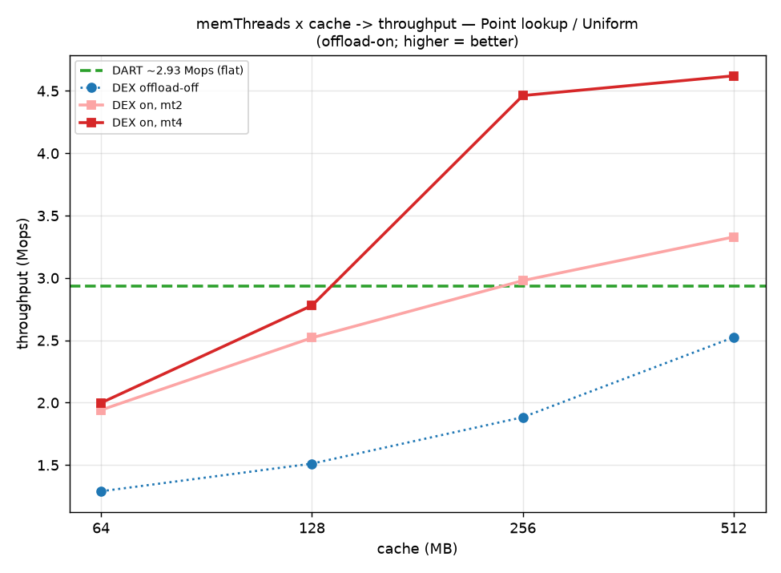
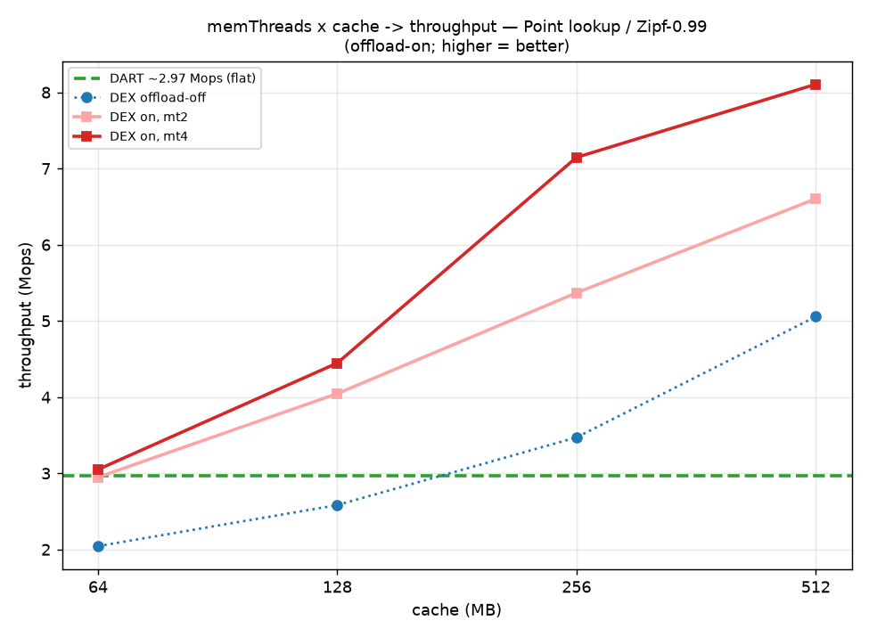
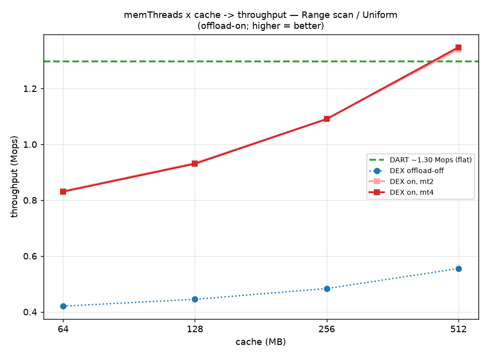
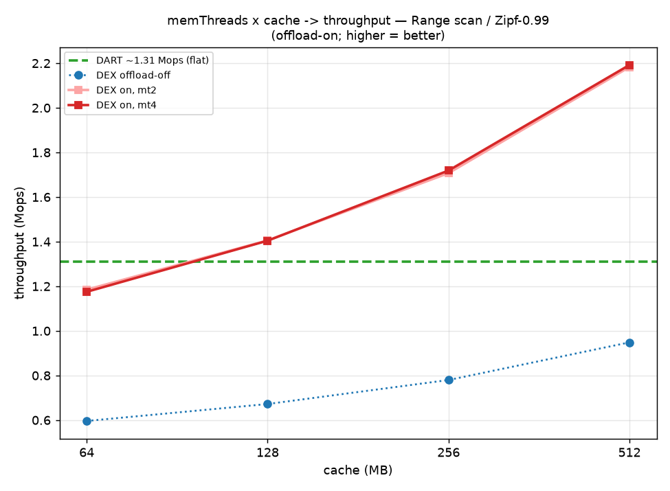
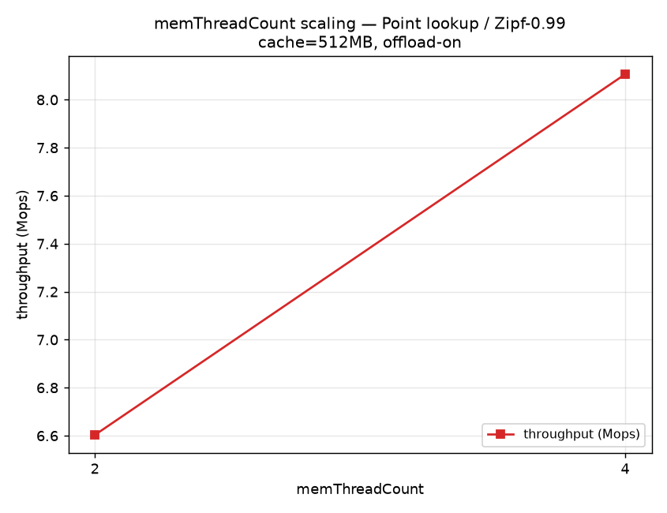
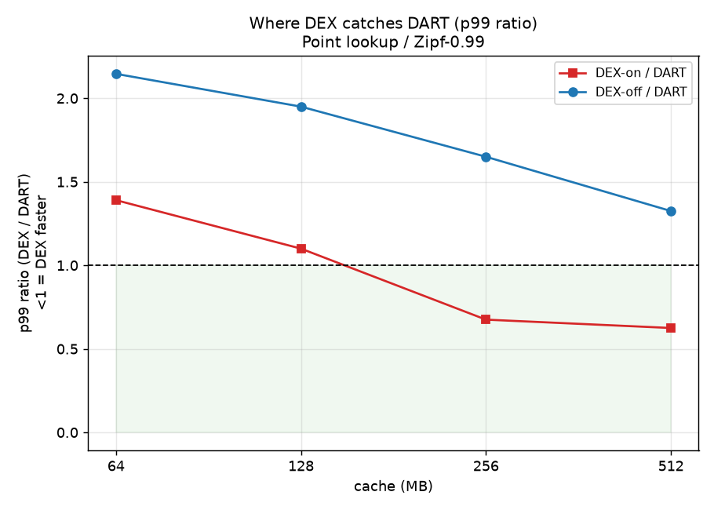
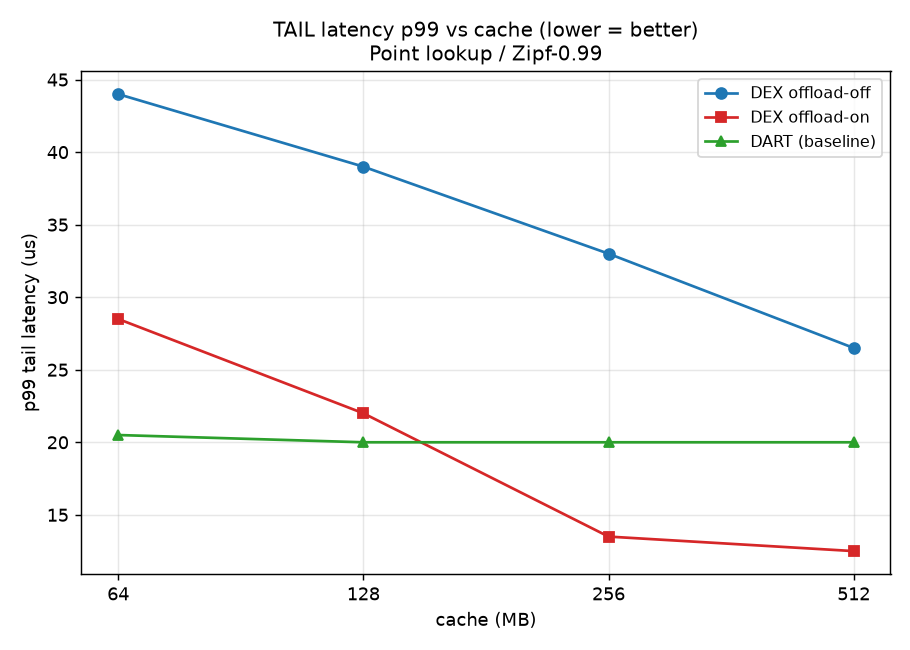
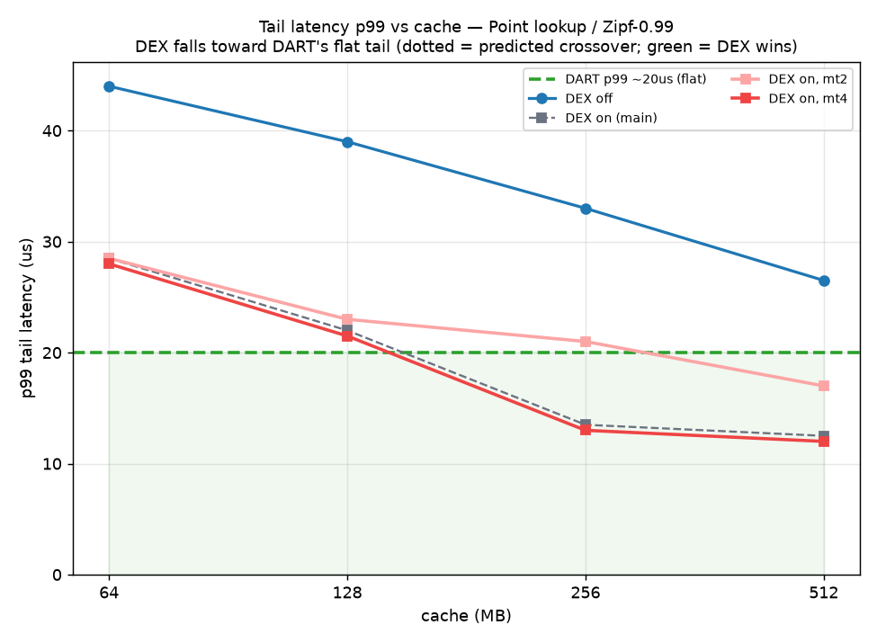
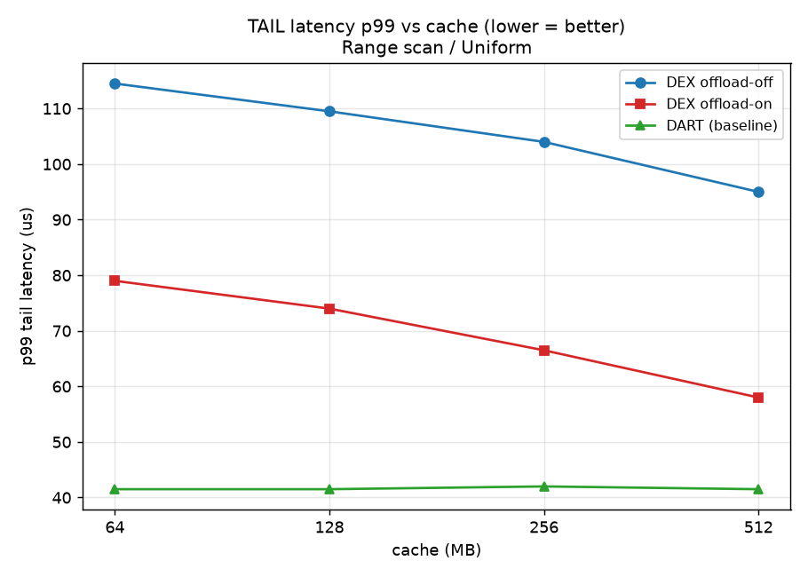

# DEX offload, cache and memory threads: questions and answers

This is a plain walk through of what the graphs are telling us. The test is 50 million
keys, 32 worker threads on the compute side, with DART drawn in as a baseline. The
throughput numbers come from `dex/build/results/summary_memthreads.csv`. In the graphs,
"mt" means how many service threads the memory node runs (the red line is mt4). Each
question has the graph that backs it up right underneath the answer.

Here are the point lookup numbers we keep coming back to (mt4, throughput in millions of
ops per second):

| cache | uniform off | uniform on | zipf off | zipf on |
|------:|------------:|-----------:|---------:|--------:|
| 64    | 1.18        | 2.00       | 1.87     | 3.05    |
| 128   | 1.38        | 2.78       | 2.35     | 4.45    |
| 256   | 1.71        | 4.46       | 3.16     | 7.15    |
| 512   | 2.29        | 4.62       | 4.59     | 8.11    |

The number of network trips each lookup pays (`rdma_read/op` plus `rpc/op`). This is the
quantity that sets throughput, because each trip is one RDMA round trip and everything else
on the path is tiny next to it:

| cache | uniform off | uniform on | zipf off | zipf on |
|------:|------------:|-----------:|---------:|--------:|
| 64    | 6.79        | 3.33       | 4.18     | 2.11    |
| 128   | 5.66        | 2.12       | 3.20     | 1.27    |
| 256   | 4.52        | 1.01       | 2.32     | 0.63    |
| 512   | 3.34        | 1.00       | 1.54     | 0.54    |

The slope of each throughput curve, meaning how many extra ops per second you buy for each
extra MB of cache (in thousands of ops per second per MB, mt4 point lookup). A steep slope
means cache is still paying off, a slope near zero means the curve has hit a ceiling:

| segment    | uniform off | uniform on | zipf off | zipf on |
|------------|------------:|-----------:|---------:|--------:|
| 64 to 128  | 3.1         | 12.2       | 7.7      | 21.8    |
| 128 to 256 | 2.6         | 13.2       | 6.3      | 21.1    |
| 256 to 512 | 2.3         | 0.6        | 5.6      | 3.8     |

---

## A. Why offload helps Uniform and Zipf by about the same factor

### Q1. Zipf has much higher throughput than Uniform in absolute terms, so why do both graphs show offload giving roughly the same factor of improvement at a given cache size?

Throughput of a point lookup is set by how many network trips it makes. A key compare or a
hash is tiny next to one round trip. Offload does one thing: it takes the leaf part of the
lookup and turns it into a single request to the memory node, instead of several one sided
reads. How many trips that removes depends on the shape of the tree, not on how the keys are
spread out.

Zipf changes a different thing. It raises the chance that a popular inner node is already in
the cache, so it shifts the whole curve upward. But it shifts the offload on and offload off
curves by the same factor, so the ratio between them stays about the same.

You can see it in the trips table at 64 MB. The Uniform case goes from 6.79 trips down to
3.33, a factor of about 2.0. The Zipf case goes from 4.18 down to 2.11, also a factor of about
2.0. Because the trip reduction factor is nearly equal, the throughput ratio is nearly equal
too: Uniform 2.00 over 1.18 is a factor of 1.7, Zipf 3.05 over 1.87 is a factor of 1.6. The
distribution shifted both curves up together, and offload kept the same factor on both.

**Proof:**  

### Q2. Where does that matching factor break, and why?

It breaks at the large cache sizes, where the bottleneck moves from the network to compute and
to memory node serving. Look at the slope table. For Uniform offload on the slope is about
12 to 13 thousand ops per second per MB up to 256 MB, then it collapses to 0.6 over the 256 to
512 segment. That collapse is the curve hitting a ceiling near 4.6 million ops. Zipf offload on
still has a slope of 3.8 over the same segment, so it keeps climbing to 8.1. Once a curve
flattens, its level is no longer governed by network trips, so the matching factor only holds
while both curves still have a meaningful slope, meaning small and medium cache.

**Proof:** 

### Q3. For range scans, is the offload on to offload off throughput ratio even steadier across the two distributions?

Yes, almost flat. Here is the throughput ratio (offload on divided by offload off), mt4:

| cache | uniform | zipf |
|------:|--------:|-----:|
| 64    | 2.17    | 2.16 |
| 128   | 2.30    | 2.30 |
| 256   | 2.47    | 2.43 |
| 512   | 2.67    | 2.54 |

A scan spends most of its time walking across many leaves, and offload turns that whole walk
into one batched request plus one read of the packed result. The batch size depends on how
many leaves the range touches, which is the same property for uniform and skewed start keys.
So the two ratio curves sit almost on top of each other.

**Proof:**  

---

## B. Reading offload as extra cache

The idea: take a throughput you get with offload on, then read along the offload off curve to
find the cache size that reaches the same throughput. We interpolate between the measured
points.

### Q4. At 128 MB with offload on you get about 4.5 million ops (Zipf, mt4). How much cache would offload off need to reach that same value?

Offload off gives 3.16 at 256 MB and 4.59 at 512 MB, a slope of about 5.6 thousand ops per
second per MB over that segment. To land on 4.45 you need around 490 MB. So offload on at
128 MB sits at the same throughput as offload off at roughly 490 MB, which means offload is
worth close to 4 times the cache here. If you read off 300 MB it is a bit low, because the
offload off curve only reaches around 3.5 million ops at 300 MB. You need close to 490 MB to
reach 4.5.

**Proof:** 

### Q5. In general, how much cache does offload stand in for, on point lookups?

Matching each offload on point to the cache the offload off curve would need:

| setting (mt4)        | offload on | offload off needs about | worth about |
|----------------------|-----------:|------------------------:|------------:|
| Zipf, on at 64 MB    | 3.05       | 240 MB                  | 3.7 times cache |
| Zipf, on at 128 MB   | 4.45       | 490 MB                  | 3.8 times cache |
| Uniform, on at 64 MB | 2.00       | 385 MB                  | 6 times cache   |
| Uniform, on at 128 MB| 2.78       | 730 MB                  | 5.7 times cache |

Rule of thumb: offload is worth about 4 times the cache for Zipf and about 6 times the cache
for Uniform point lookups. The 730 MB figure is past the range we tested, so it is an estimate
from the offload off slope.

**Proof:**  

### Q6. Why is offload worth more cache for Uniform (about 6 times) than for Zipf (about 4 times)?

Cache only pays off when the cached pages get used again. With Uniform there is almost no reuse
on the leaves, so the offload off curve has a shallow slope, about 2.3 to 3.1 thousand ops per
second per MB across the whole range. It moves from 1.18 to 2.29 million ops as cache grows
from 64 to 512 MB, a small gain for 8 times the memory. Offload sidesteps that by pushing the
leaf work down no matter what, so against a curve with such a shallow slope it looks like a
large amount of cache. With Zipf the cache already holds the hot leaves (the offload off slope
is steeper, around 5.6 to 7.7), so offload has a smaller edge over it.

**Proof:**  

### Q7. For range scans, how much cache replaces offload?

Basically none in the range we tested. The offload off scan curve has an almost flat slope,
about 0.25 to 0.33 thousand ops per second per MB for uniform, so it only moves from 0.38 to
0.50 million ops across 64 to 512 MB. Offload on at just 64 MB (Zipf, 1.18 million ops) is
already above offload off at 512 MB (0.86). Cache cannot stand in for scan offload here,
because turning a multi leaf walk into one batched request is a structural change that more
cache cannot reproduce.

**Proof:**  

---

## C. When do extra memory threads matter

### Q8. When does adding memory service threads (going from 2 to 4) raise throughput, and when does it do nothing?

It only helps when the memory node serving the requests is the bottleneck, and that happens
when offload is on and the cache is large:

| Zipf, on  | mt2  | mt4  | gain |
|-----------|-----:|-----:|-----:|
| 64 MB     | 2.95 | 3.05 | 3 percent  |
| 512 MB    | 6.60 | 8.11 | 23 percent |

At 64 MB the lookup still pays for inner node reads on the compute side (the trips table shows
about 1.3 reads plus 0.8 RPC per op), so it is limited by the network and compute, and more
memory threads do nothing. At 512 MB the inner nodes are all cached, the trips table is down
near one RPC per op, and now the memory threads are the limit. So going from 2 to 4 threads
adds 23 percent.

**Proof:** 

### Q9. Do extra memory threads change anything when offload is off?

No, the curves are flat in thread count. Offload off with 2, 4, or 6 threads gives the same
throughput (Uniform at 64 MB is 1.175, 1.177, 1.167). With offload off the memory node does no
real work, all the access is one sided RDMA, so its thread count does not matter. This is the
control that proves the gains in Q8 come from request serving.

**Proof:** 

### Q10. Which setting is most sensitive to memory threads, and how does that connect to queue load?

Uniform, offload on, 256 MB. It goes from 2.98 at mt2 to 4.46 at mt4, a 50 percent rise, the
largest one. That is the point where the inner nodes are cached but every lookup still sends
one request to the memory node, so 2 threads saturate (high per thread queue load) and adding
threads converts directly into throughput. Expect the per thread queue load on node 1 to be
highest right here, and to drop as you go from 2 threads to 6.

**Proof:** 

---

## D. DEX versus DART

### Q11. At what cache size does DEX pass DART (around 2.9 million ops, flat) for point lookups?

Zipf with offload on is above DART at every cache size (3.05 at 64 MB already beats 2.97).
Zipf with offload off crosses DART around 200 MB. Uniform with offload on crosses around
140 MB. Uniform with offload off never crosses DART in the range we tested, because its slope
is too shallow, its best is 2.29 at 512 MB, still below 2.93. So offload pulls the crossing
point down to a small cache. Without offload, Uniform DEX never gets there in this range.

**Proof:**  

### Q12. On the tail latency plot, the DEX on curve drops below DART around 128 MB but DEX off stays above. What does that say?

On that plot, below 1.0 means DEX has the lower p99. The DEX on curve crosses below 1.0 around
140 MB, so it becomes the lower tail system, and it keeps dropping, down to about 0.63 at
512 MB. The DEX off curve stays above 1.0 the whole way (still 1.33 at 512 MB), so without
offload DEX never wins on tail latency. Same story as the throughput in Q11: offload is what
makes DEX competitive on the tail.

**Proof:** 

---

## E. Latency

### Q13. How much does offload cut the p99 latency, and does it depend on cache?

Offload cuts p99 by removing network trips, and the cut grows with cache. For Zipf at mt4: at
64 MB p99 goes from 43 to 28 microseconds, about a third off. At 512 MB it goes from 26 to 12
microseconds, about half off. At large cache the offload lookup is a single request, so its
tail is tight, while offload off still chains several reads, so its tail stays wide.

**Proof:**  

### Q14. Scans have a much higher p99 than lookups. Does offload cut the scan tail by a similar share?

Yes. For scan p99 (uniform, mt4): offload off goes from 112 to 92 microseconds as cache grows,
offload on goes from 76 to 55. So offload trims roughly a third to 40 percent off the tail at
every cache size, the same batching win from Q3 showing up in the tail.

**Proof:** 

---

## F. Putting it together

### Q15. If you have a fixed memory budget, when do you spend it on cache versus on offload plus more service threads?

If the workload is uniform or has weak locality, spend it on offload. The offload off curve has
a shallow slope, so cache is nearly wasted (Q6), and offload is worth about 6 times the cache
(Q5). Add memory threads only once the cache is large enough that serving becomes the limit
(Q8).

If the workload is zipf or has strong locality, cache has a steeper slope and really does help,
but offload still adds about 4 times on top (Q5), so the best mix is offload on with a moderate
cache.

For scans, always use offload, since the offload off slope is almost flat and cache cannot
replace it (Q7).

For memory threads, only bother once you are offload on and cache rich enough to be limited by
serving (Q8 and Q10). Otherwise leave them at 2.

### Q16. In one line, what is the single idea behind almost all of this?

Throughput is roughly one divided by the number of network trips per operation. Cache removes
inner node trips, and how steep that slope is depends on the distribution. Offload removes the
leaf and scan trips, and that depends on the tree shape, not the distribution. Memory threads
only matter once the last remaining trip is a request the memory node has to serve. Everything
above follows from that.
