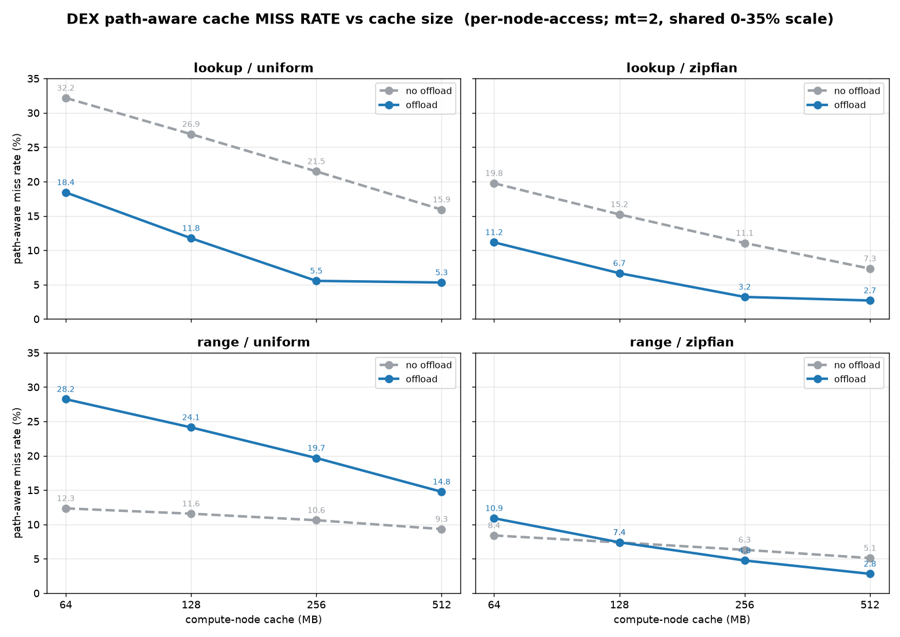
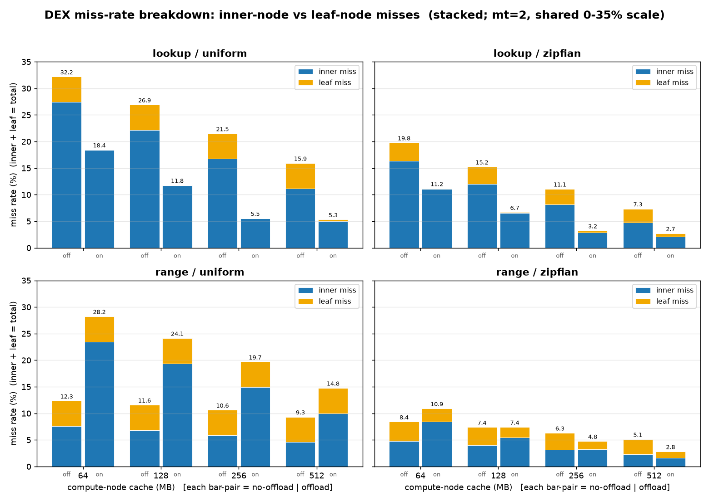
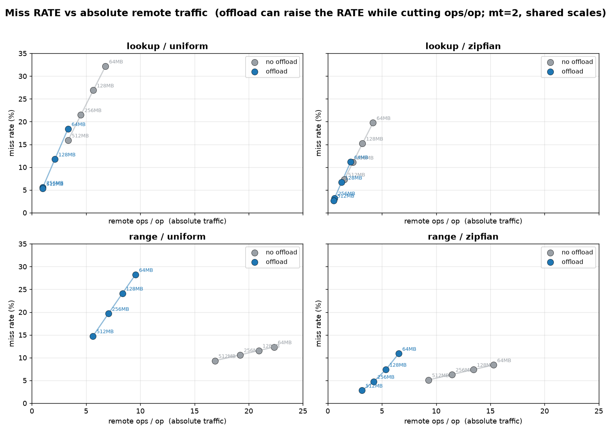
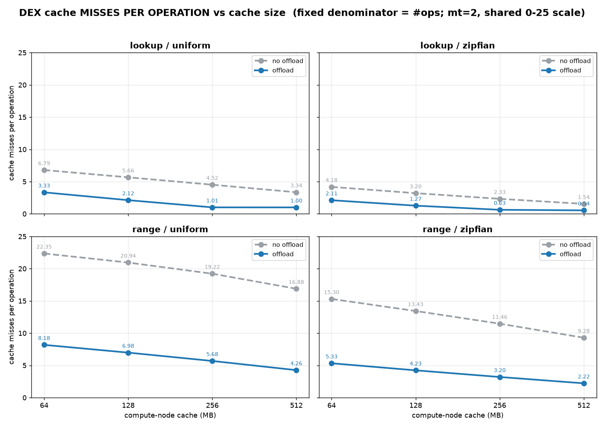
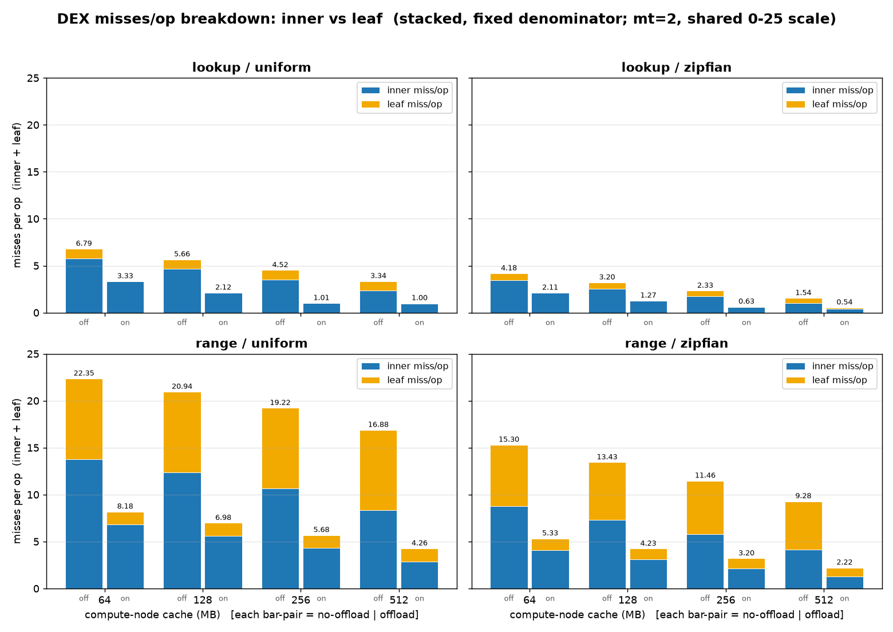
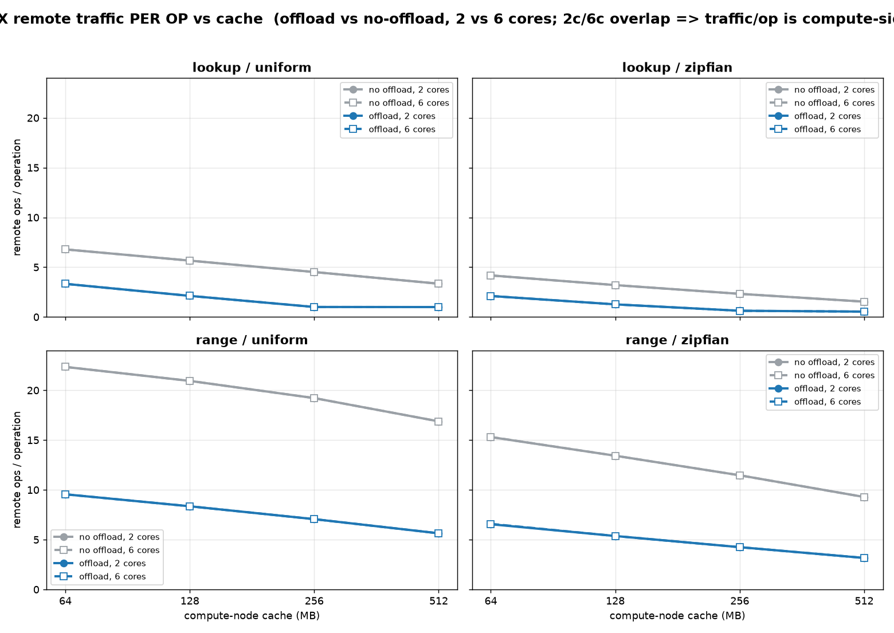
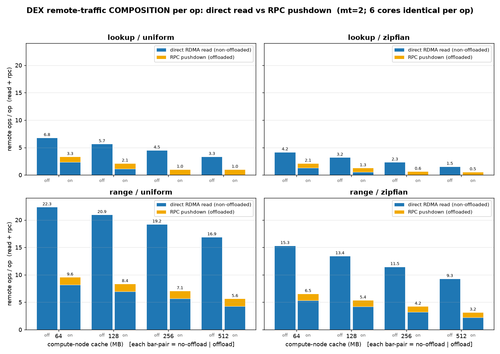
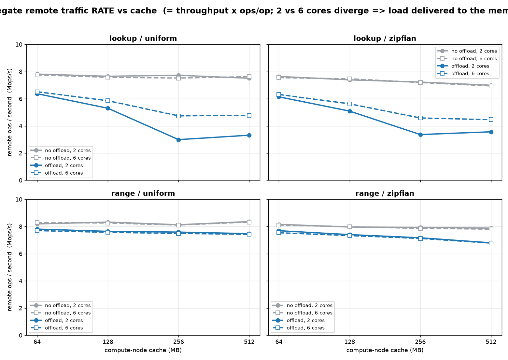

# DEX cache misses and remote traffic: how we measure them and what the sweep shows

This is a plain walk through of how DEX's cache behaviour is instrumented and what the
numbers mean, written so each claim has the graph that backs it up right underneath. The
test is 50 million keys, 32 worker threads on the compute side, a height-22 B+-tree, swept
over compute-node cache of 64 to 512 MB, with offloading off (`rpc_rate=0`) and on
(`rpc_rate=1`), and with the memory node running either 2 or 6 service threads ("cores").
Point lookups and range scans are each run against a uniform and a Zipf-0.99 key
distribution.

Two numbers do most of the work in this document, and it is important to keep them apart:

- **Path-aware miss rate** = misses divided by the node accesses the *compute node
  actually performs*. It is counted once per tree level descended: a node found in the
  local cache is a hit, a node that must be fetched from the memory node is a miss, split
  into inner-node and leaf-node misses. Source: `summary_qload.csv`.
- **Misses per operation** = the same misses divided by the *number of operations*. Source:
  `misses_per_op.csv`, parsed from the raw per-run counts in the logs.

The first has a denominator that offloading changes; the second does not. Most of the
confusion this document clears up comes from that one difference.

Two reference tables we keep coming back to. **Misses per operation, point lookup, 2 cores:**

| cache | uniform off | uniform on | zipf off | zipf on |
|------:|------------:|-----------:|---------:|--------:|
| 64    | 6.79        | 3.33       | 4.18     | 2.11    |
| 128   | 5.66        | 2.12       | 3.20     | 1.27    |
| 256   | 4.52        | 1.01       | 2.33     | 0.63    |
| 512   | 3.34        | 1.00       | 1.54     | 0.54    |

**Misses per operation, range scan, 2 cores:**

| cache | uniform off | uniform on | zipf off | zipf on |
|------:|------------:|-----------:|---------:|--------:|
| 64    | 22.35       | 8.18       | 15.30    | 5.33    |
| 128   | 20.94       | 6.98       | 13.43    | 4.23    |
| 256   | 19.22       | 5.68       | 11.46    | 3.20    |
| 512   | 16.88       | 4.26       | 9.28     | 2.22    |

---

## A. Measuring the misses

### Q1. How is the cache miss actually counted in DEX, and is the number trustworthy?

DEX is a path-aware cache: it caches leaf pages together with the inner nodes on the path
to them. The counter sits inside the tree traversal loop and fires once per level
descended. When the next child is resolved from the local cache it records a hit; when the
child is not resident and must come from the memory node it records a miss, and it labels
that miss inner or leaf by the level of the parent (level 1 is the leaf's parent). The
headline miss rate is then misses over (hits plus misses). The counters are per thread and
cache-line spaced, so the 32 workers never contend, and they are reset at the start of each
measured run.

Two independent sanity checks say the instrumentation is sound. First, for a point lookup
with offload off the leaf misses per operation come out at almost exactly 1.00 at every
cache size (0.9999, 0.9997, 0.9990, 0.9968). That is exactly right: each lookup touches one
leaf, and with a 1.9 GB index that does not fit the cache, that leaf is nearly always a
miss. Second, the misses per operation reconcile with the independent RDMA counters: point
lookup, uniform, offload off, 64 MB gives 6.79 misses per op, and the separate
`rdma_read/op` counter reads 6.79. Two counters that were never wired together agree.

One scope limit to state honestly: the path-aware counter is instrumented in the lookup and
range-scan traversals only, not in insert/update/delete. Every configuration in this
document is 100% lookup or 100% scan, so the numbers here are complete for what was run.

### Q2. Does DART measure the same thing?

Not directly, and this matters for any DEX-vs-DART comparison. DART has no per-node hit/miss
counter. It only classifies each *operation* as local or remote using its per-thread RDMA
round-trip counter: zero round trips is local, one or more is remote. That is an
operation-level fraction, coarser than DEX's per-node-access miss rate. The quantity that is
comparable across the two systems is the operation-level "fraction of ops that went remote,"
which both binaries emit; DEX's finer node-level miss rate has no DART equivalent.

---

## B. Miss rate versus cache size

### Q3. How does the path-aware miss rate move as the cache grows?

It falls monotonically in every configuration, because more of the index stays resident.
Uniform is always worse than Zipf at the same cache size, since uniform has no locality to
keep hot nodes cached. Even at 512 MB the uniform lookup miss rate with offload off is still
15.9%, because the roughly 1.9 GB index never fits the 64-512 MB cache. The panels share one
0-35% scale so the four workloads are directly comparable.

**Proof:** 

### Q4. What is the split between inner-node and leaf-node misses?

With offload off there is a leaf-miss floor of about 4.75% under uniform that barely moves
with cache: the leaves never come close to fitting, so almost every leaf access misses no
matter how big the cache is. The rest of the miss rate is inner-node misses, and that part
is what shrinks as cache grows. The stacked bars make the floor (amber) visible sitting
under the shrinking inner band (blue).

**Proof:** 

---

## C. The miss-rate trap

### Q5. Why does offloading show a *worse* miss rate than no-offload for range/uniform?

Because the miss rate is a ratio, and offloading changes its denominator, not the amount of
useful work. The denominator is "node accesses the compute node performs." A no-offload
range scan walks down to the entry leaf and then pulls and re-traverses the sibling leaf
chain locally, batch after batch; every one of those repeated descents over already-cached
nodes is counted as a cheap hit, and there are many of them, so the miss fraction looks
small (12.3% at 64 MB). Offload sends one request at the level-1 boundary and the memory
node walks the whole sibling chain remotely, so the compute node never performs those
re-traversals and all those cheap hits leave the count. Fewer accesses remain, dominated by
the boundary miss, so the *fraction* jumps to 28.2%, even though the absolute remote traffic
per op has dropped from 22.35 to 8.18. The tell is in the breakdown: the leaf miss rate is
identical (4.75) in both, while the inner miss rate triples purely because the hit
denominator collapsed.

**Proof:**  

### Q6. Shouldn't the miss rate be identical for offload and no-offload, since the cache and working set are the same?

Only if the rate were measured over a fixed set of accesses. It is not. The rate is measured
over the accesses the compute node actually makes, and offloading's whole purpose is to
*not* make the bottom-subtree and leaf-chain accesses locally: it hands them to the memory
node. Same logical operation, different set of counted accesses, therefore a different ratio.
They would be equal only if both configurations performed the same local traversal, which is
exactly what offload changes. The `miss_vs_reads_per_op` figure makes the point directly: the
offload points sit up and to the left, higher miss rate but lower absolute traffic per op.

**Proof:** 

---

## D. Misses per operation, the honest metric

### Q7. What metric makes offload and no-offload comparable again?

Misses per operation. Its denominator is the number of operations, which is identical
whether offload is on or off, so nothing cancels or shifts underneath it. On this metric the
anomaly disappears: offload is at or below no-offload in every single panel. The range/uniform
case that looked worse on the rate (12% up to 28%) reads correctly here: 22.35 down to 8.18
misses per op, roughly 2.7 times less fetching. The rate was misleading; misses per op tells
the truth.

**Proof:** 

### Q8. What does the inner-versus-leaf split look like once it is per operation?

It exposes the actual mechanism. For a point lookup with offload off the leaf band is about
1.0 per op (one leaf touched, almost always a miss). Turn offload on and the leaf band
collapses to nearly zero: the leaf is served by the memory node inside the RPC and is never
fetched as a node on the compute side, so it stops being counted. The remaining misses are
the inner-node walk down to the offload boundary. For range scans the leaf component stays
non-zero because the scan still needs the entry leaf, but the total per op still drops
sharply.

**Proof:** 

---

## E. Remote traffic

### Q9. How does remote traffic per operation respond to cache, offloading, and going from 2 to 6 cores?

Cache growth slides every curve down (more index resident, fewer fetches). Offloading is the
big lever, cutting traffic per op by roughly 2 to 2.7 times at every cache size. Going from 2
to 6 cores does essentially nothing to traffic per op: the 2-core and 6-core markers sit on
top of each other. That is the expected result and a useful check: how many remote ops an
operation issues is a compute-side property set by cache misses, not by how many threads the
memory node uses to serve them.

**Proof:** 

### Q10. What is that remote traffic actually made of, and how does offload change the mix?

No-offload traffic is 100% direct one-sided RDMA reads. Offloading replaces a chunk of those
reads with a much smaller number of RPC pushdowns. For point lookups at 256 MB and above the
direct-read band almost vanishes and the operation becomes essentially "one RPC" (uniform at
256 MB: 4.5 reads collapse to about 1.0 total, nearly all RPC). For range scans offload keeps
a direct-read component for the entry leaf plus one scan RPC, taking the total from about 22
down to about 9.6.

**Proof:** 

### Q11. If cores do not change traffic per op, when do 2 versus 6 cores matter at all?

On the *rate* of remote traffic, not the amount per op. Multiply traffic per op by throughput
and you get remote ops per second, the load actually delivered to the memory node. Here the
two core counts diverge: since per-op traffic is fixed, 6 cores only helps by serving misses
faster, reaching higher throughput and therefore pushing more remote ops per second. The gap
is clearest in the lookup panels, where 6-core offload rides above 2-core offload. So cores
are a serving-side lever: they move the delivered rate, never the per-op demand.

**Proof:** 

---

## F. Why offloading helps both distributions by the same factor

### Q12. Zipf and uniform have very different absolute throughput, so why is the offload-to-no-offload throughput ratio about the same for both?

Because the distribution enters as a multiplicative factor that cancels in the ratio. Start
from the fact that in this regime throughput is set by remote traffic: throughput is roughly
capacity divided by misses per op. You can see it for no-offload, where throughput times
misses per op is nearly constant, about 7.7 across all four caches (1.15 times 6.79, 1.35
times 5.66, and so on). Now write misses per op as a product of three pieces: a baseline, a
locality factor set by the distribution, and a structural factor set by offloading. The
distribution changes which nodes are hot, so it scales the whole curve (Zipf has fewer misses,
uniform more), but it multiplies the offload-on and offload-off curves by the *same* factor.
When you divide offload-on by offload-off to get the speedup, that shared locality factor
cancels and only the structural offload factor remains. That is why the ratio does not depend
on the distribution.

The numbers show the cancellation. Throughput ratio, offload on over off, 2 cores:

| cache | uniform | zipf |
|------:|--------:|-----:|
| 64    | 1.66    | 1.59 |
| 128   | 1.85    | 1.74 |
| 256   | 1.74    | 1.73 |
| 512   | 1.48    | 1.45 |

The absolute throughputs differ by about 2x between the two distributions, yet the ratios
line up at every cache size. You can see the same shared locality factor directly in the
misses-per-op table: at 64 MB the Zipf-over-uniform ratio is 4.18/6.79 = 0.62 for offload off
and 2.11/3.33 = 0.63 for offload on, essentially the same number, which is exactly the factor
that cancels.

**Proof:**  

### Q13. The throughput speedup (about 1.5 to 1.85) is smaller than the misses-per-op reduction (about 2 to 2.7). Why, and does that break the argument?

It does not break it. There is a second constant: an RPC costs the memory node a little more
to service than a pure one-sided read, so the effective capacity with offload on is a bit
lower than with offload off (about three-quarters). That dampens the speedup below the raw
traffic ratio. But that constant is a property of the RPC-versus-RDMA mechanism, not of the
key distribution, so it is the same for uniform and Zipf and does not disturb the
cancellation in Q12. In short, speedup is (capacity ratio) times (offload traffic factor),
and both terms are independent of the distribution.

**Proof:**  

---

## G. The one idea

### Q14. In one line, what ties all of this together?

Count remote work per operation, not as a rate. Misses per operation has a fixed denominator,
so it compares cleanly across offload and cache; the path-aware miss *rate* shares a
denominator that offloading shrinks, which is why it can rise while real work falls. Cache
removes inner-node fetches at a slope set by the distribution, offloading removes the leaf and
scan fetches at a factor set by the tree shape, and memory-node cores change only how fast the
remaining fetches are served. Everything above follows from that.
